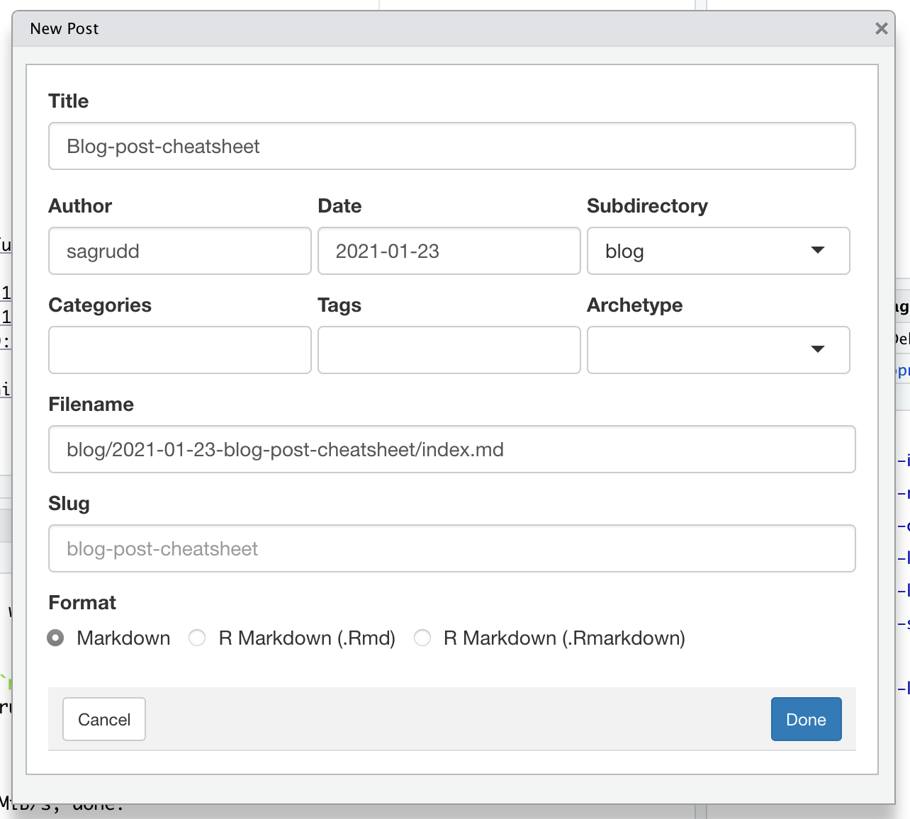

It is now two weeks since the last post - not a good start to the plan to be a
little more active with social updates, progress reports and thoughts.

Here is a brief reminder (for the author alone) of the process for creating a
blog post. 

- The first task is to use the `Addins` dialog in RStudio to create a new post. 



We the hack at the `Rmd` (or `md`) template for a bit, share words of wisdom and
thoughts. Proof-read, commit and push. Then finally - using a `Terminal` tab
or window just run the script

```
# pull, prepare, commit and push
sh ./scripts/deploy.sh
```

Should be as simple as that...

**edits** - so the page was published to `gh-pages` and guess what? The figure
that should have been included above doesn't show - *macOS* standard screenshot
nomenclature with lots of spaces ... The easiest fix here is hopefully just to
rename the file from `Screen Shot 2021-01-23 at 4.43.02 pm.png` to
`ScreenShot2021-01-23.png`.

Nextly, the image included appears **MASSIVE**. There are some ways to deal with
this; this could involve rescaling the image using e.g. `ImageMagick` but
just scaling the image for display would be preferable. There are a load of
comments and discussions that using the HTML ` ...` would be the way
to go. This however seems to lead to a `<!-- raw HTML omitted -->` being placed
in the rendered HTML page.

Curious indeed. This is apparently something curious to do with HUGO; the
rendering software deep behind this `blogdown` software. The solution here was
as simple as enabling unsafe HTML - this can be achieved by pasting the
following lines into the `config.toml` file that defines this site.

```
[markup.goldmark.renderer]
  unsafe = true
```

To finish off let's replace our canonical ``
with the scaled 
`` and we're
done!