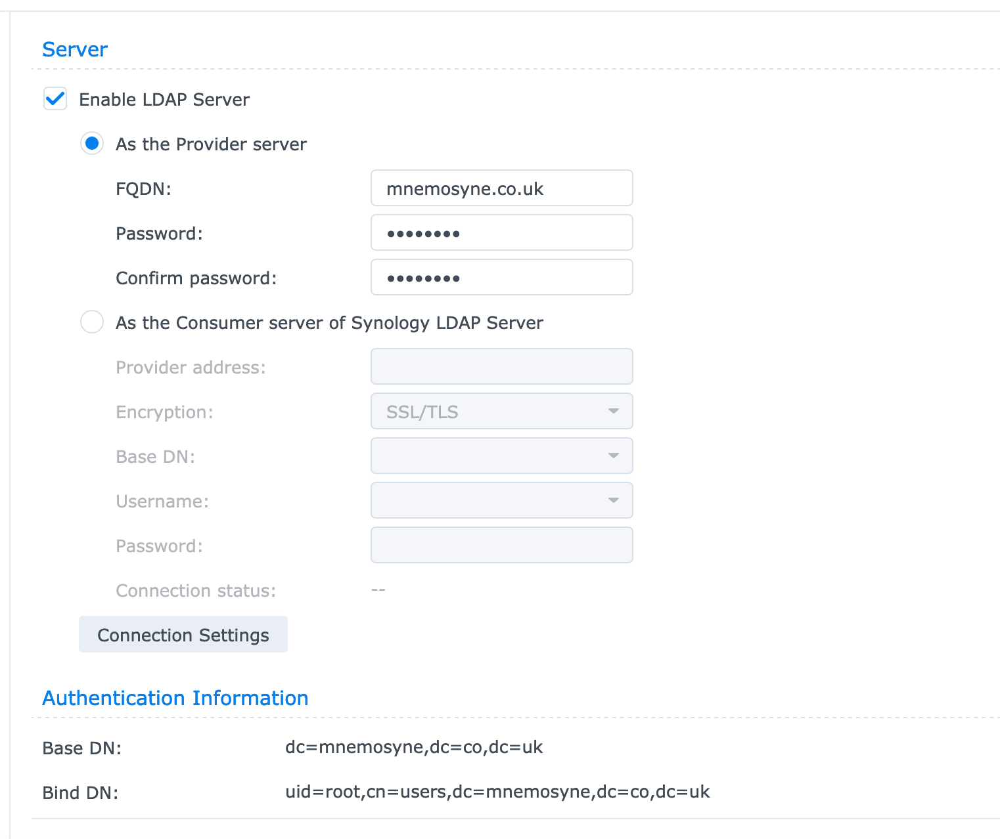

##### Preamble

One of the reasons for the dearth of intended posts in January has been an
exercise in trying to demonstrate that the RaspberryPi can actually do
bioinformatics. We'll have a look at 
[symbioinfo](https://sagrudd.github.io/symbioinfo/) in an upcoming blogpost - 
this could be a justification for genomics analyses on a humble RaspberryPi.

As I have gained experience in getting software to compile on the RaspberryPi
I have tried to boost performance by running more than one Pi at the same time.
This is a satisfactory solution but using `git pull` and `git push` to
synchronise data between devices that are but a few centimeters apart seems
counter intuitive.

What I would appreciate would be a shared home filesystem across these computers
and I guess while we're doing that there are a few other computers that might
also benefit from this? The mission for this snowy Sunday afternoon is therefore
to establish a shared home filesystem across initially just a couple of Pi and
do document this a brief blogpost.

##### LDAP

LDAP (Lightweight Directory Access Protocol) is an open and cross platform
protocol used for directory services authentication. LDAP is often used to
provide a central service for the storage of usernames and passwords. The first
step in this afternoon's mission is thus to establish an LDAP server on the
home network.

Earlier we looked at a 
[disk update](https://sagrudd.github.io/blog/2021-01-10-shucking-disks/) on a 
largely unused Synology server. Synology provide their own implementation of
an LDAP server - we'll use this RS816 device to share both LDAP and NFS for this
exercise.



Creating an LDAP server really is as simple as entering an `FQDN` and a password
and creating a user. I have created a user called `dummy` with an equally
nonsensical password that we'll use to demonstrate proof-of-concept. While you
are logged into the Synology device also ensure that home directories are
created for the LDAP users.


It is also probably worth having a quick check here that the LDAP server is
actually spitting out the expected content

```
ldapsearch -x -LLL -h 192.168.1.119 \
    -D "uid=root,cn=users,dc=mnemosyne,dc=co,dc=uk" \
    -w topsecret
```

##### disable SELinux

I am not sure that I really understand or have the patience to get to grips
with SELinux. I am going to disable it ...

```
sudo vim /etc/sysconfig/selinux
```

##### Fedora and authenticating against LDAP.

For this afternoon's play we have a clean install of `Fedora 33` on a RaspPi
that has been assigned an IP address of `192.168.1.235`.

Let's update the system and install a couple of LDAP client pacakges

```
sudo yum update
sudo yum install openldap-clients \
    sssd-ldap \
    sssd-tools \
    oddjob-mkhomedir \
    authselect
```

The next step is to define our LDAP server. Using our preferred editor we would
like to edit the file `/etc/openldap/ldap.conf` to include the `BASE` and `URI`
for our LDAP server - I'll use the vim editor here and include the two lines
as shown below.

```
sudo vim /etc/openldap/ldap.conf

BASE    dc=mnemosyne,dc=co,dc=uk
URI     ldap://ldap.mnemosyne.co.uk
```

It is **CRITICAL** to note here that LDAP only consumes URI with FQDN - an IP
address will not cut the mustard. I am not running a DNS at home so for things
to work intelligently (rather than throwing assorted errors) we should add an
entry to our `/etc/hosts` file to identify the LDAP server

```
echo "192.168.1.119 ldap ldap.mnemosyne.co.uk" | \
    sudo tee -a /etc/hosts
```

And now for the most important file - `/etc/sssd/sssd.conf` - let's open this
up using `vim` (or equivalent) and add the following lines

```
[sssd]
config_file_version = 2
services = nss, pam
domains = default

[nss]

[pam]

[domain/default]
ldap_schema = rfc2307bis
ldap_id_use_start_tls = False
cache_credentials = False
ldap_search_base = dc=mnemosyne,dc=co,dc=uk
id_provider = ldap
auth_provider = ldap
chpass_provider = ldap
access_provider = ldap
sudo_provider = ldap
ldap_uri = ldap://ldap.mnemosyne.co.uk
ldap_default_bind_dn = uid=root,cn=users,dc=mnemosyne,dc=co,dc=uk
ldap_default_authtok = topsecret
ldap_search_timeout = 50
ldap_network_timeout = 60
ldap_access_order = filter
ldap_access_filter = (objectClass=posixAccount) 
override_shell = /bin/bash
ldap_auth_disable_tls_never_use_in_production = True

```

We are almost done for part 1.

##### autocreate home directories

When a user defined in the LDAP database logs into a given computer for the
first time it is likely that the `/home/<user>/` directory has not been
created. The command below adds a line to the `/etc/pam.d/system-auth` file
that instructs a home directory to be created if it does not already exist!

```
echo "session optional pam_oddjob_mkhomedir.so skel=/etc/skel/ umask=0022" | \
    sudo tee -a /etc/pam.d/system-auth
```

Now let's start the associated system service (and ensure that it is kept
enabled at system boot)

```
sudo systemctl start oddjobd
sudo systemctl enable oddjobd
```

##### double-check our settings and test our LDAP connection ...

We have done a load of cut-and-paste here and have transposed some of my
thoughts and settings into something that hopefully works for a shiny new
computer system ... Let's now make sure that it all works!

`sssctl config-check` is a program that performs some sanity checking on the
`sssd` configuration files. Give this a quick run and watch the error (the files
that we have created have the wrong permissions so a quick fix is required)

```
sudo sssctl config-check
File ownership and permissions check failed. Expected root:root and 0600.
sudo chmod 600 -R /etc/sssd/sssd.conf
```

and we can now start the system with the new configuration

```
sudo systemctl restart sssd
sudo systemctl enable sssd
```

We can now check to see if we can discover our `<dummy>` user and can test the
logon (and home directory creation) of our RaspberryPi.

```
$ id dummy
uid=1000001(dummy) gid=1000001(users) groups=1000001(users)
```

Looking great! We have connected to the LDAP server on the Synology device and
have identified the `<dummy>` user. Furthermore our LDAP user can now logon to
the system and the `$home` directory is available and ready to go.

##### What's next?

This Sunday afternoon project didn't quite go as far as I had hoped - it has
been several years (2016 was the last time) that I performed such a workflow
and my memory and lack of coherent notes made for slower than expected progress.
I see three obvious follow on blogposts to cover further RaspberryPi LDAP
mischief

- Automounting an LDAP home directory (we have created the directory here; but no
content is shared)
- LDAP users and sudo rights using a Fedora / Synology combo
- Securing LDAP traffic on a self-signed Synology server (the current setup uses
the `ldap_auth_disable_tls_never_use_in_production` flag)

Watch this space; and I'll include these updates.

##### References and links

- [Fedora 31 LDAP client](https://www.server-world.info/en/note?os=Fedora_31&p=openldap&f=3)
- [Synology LDAP and exported home](https://www.synology.com/en-global/knowledgebase/DSM/tutorial/Management/How_to_join_Mac_Linux_client_computers_to_LDAP_Server#t3)
